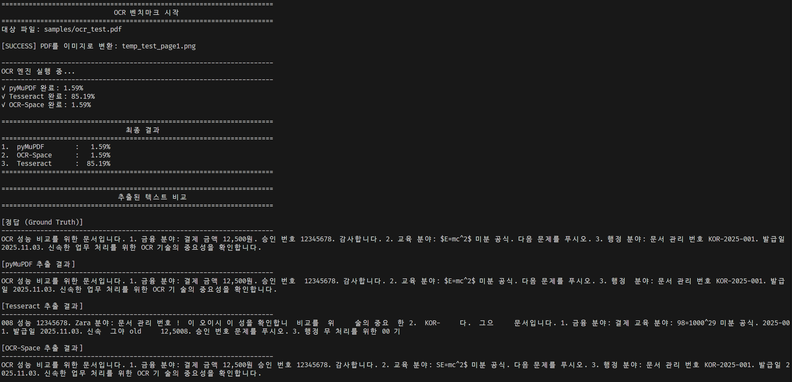

# OCR 성능 비교 과제

> 세 가지 OCR 엔진(pyMuPDF, Tesseract, OCR-Space)의 한글 텍스트 인식 성능을 비교 분석합니다.

<br>

## 성능 비교 결과

| 순위 | OCR 엔진      | 에러율 | 정확도 | 특징                        |
| :--: | ------------- | :----: | :----: | --------------------------- |
|  1   | **pyMuPDF**   | 1.59%  | 98.41% | 디지털 PDF 텍스트 직접 추출 |
|  2   | **OCR-Space** | 4.76%  | 95.24% | 클라우드 AI 기반 OCR        |
|  3   | **Tesseract** | 85.19% | 14.81% | 오픈소스 이미지 OCR         |

<br>

## 빠른 시작

### 1️⃣ 저장소 클론

```bash
git clone https://github.com/leelaeloo/AI-homework.git
cd AI-homework/ocr-homework/
```

### 2️⃣ 패키지 설치

```bash
# Python 패키지
pip install python-Levenshtein matplotlib pillow pytesseract requests pymupdf

# Tesseract OCR (Ubuntu/Debian)
sudo apt-get install tesseract-ocr tesseract-ocr-kor

# Tesseract OCR (macOS)
brew install tesseract tesseract-lang
```

### 3️⃣ 실행

```bash
python ocr_homework.py
```

<br>

## 과제 폴더 구조

```
ocr-homework/
├── ocr_homework.py              # 메인 벤치마크 스크립트
├── samples/
│   └── ocr_test.pdf             # 테스트용 PDF 문서
├── ocr_benchmark_chart.png      # 결과 차트 (자동 생성)
├─  screenshots
│   └── result.png               # 결과 스크린샷
└── README.md
```

<br>

## 설정

### OCR-Space API 키 설정

무료 API 키를 [OCR.space](https://ocr.space/ocrapi)에서 발급받은 후, 코드에서 수정하시면 됩니다.

```python
@dataclass
class Config:
    api_key: str = "YOUR_API_KEY_HERE"  # 본인의 API 키 입력
    pdf_path: str = "samples/ocr_test.pdf"
    ...
```

<br>

## 실험 방법

### 평가 지표: Levenshtein 거리

- 정답 텍스트와 OCR 추출 텍스트 간의 편집 거리 계산
- 낮은 에러율 = 높은 정확도

### 테스트 데이터

- 금융, 교육, 행정 분야의 한글 텍스트
- 숫자, 특수문자, 영문 포함

<br>

## 주요 기능

- **3가지 OCR 엔진 동시 비교**
- **자동 성능 측정 및 시각화**
- **실제 추출 텍스트 출력**
- **에러율 기반 순위 매기기**

<br>

## 실행 결과 예시



<br>

## 결론

| OCR 엔진      | 추천 사용 사례                   |
| ------------- | -------------------------------- |
| **pyMuPDF**   | 디지털 PDF 문서 텍스트 추출      |
| **OCR-Space** | 스캔 이미지, 사진 속 텍스트 인식 |
| **Tesseract** | 오픈소스 필요, 영문 위주 문서    |

<br>

---
