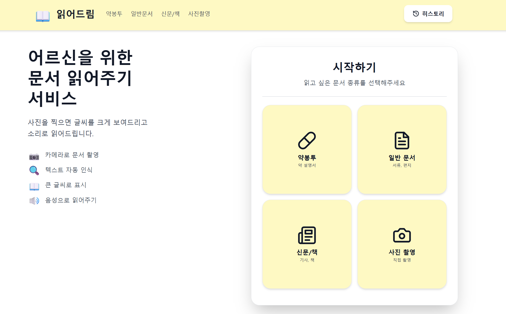
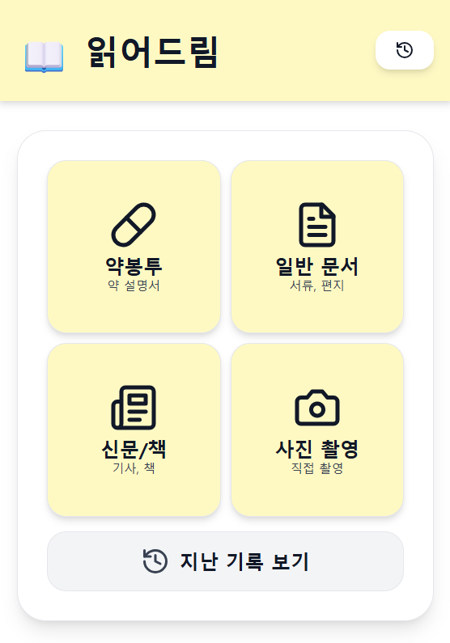

# 읽어드림 - 시니어 친화 OCR PWA

> 어르신들을 위한 문서 읽어주기 앱

---

## Privew

- PC 화면

  

- APP 화면

  

## 프로젝트 소개

**타겟 사용자:** 시니어층 (60세 이상)

**주요 기능:**

- 📷 카메라로 문서 촬영
- 🔍 텍스트 자동 인식 (OCR)
- 📖 큰 글씨로 결과 표시
- 🔊 음성으로 읽어주기 (TTS)
- 💾 히스토리 저장 및 관리

**사용 시나리오:** 약 봉투 글씨 읽기, 공공기관 서류 확인, 신문 기사 크게 보기

---

## 기술 스택

| 구분         | 기술                                           |
| ------------ | ---------------------------------------------- |
| **Frontend** | Next.js 14, React 18, TypeScript, Tailwind CSS |
| **Backend**  | FastAPI, Python 3.12, SQLAlchemy, SQLite       |
| **OCR**      | Tesseract OCR, pytesseract                     |
| **TTS**      | Web Speech API                                 |
| **배포**     | Docker, Docker Compose                         |

**아키텍처:**

```
브라우저 → Frontend(:3000) → Backend(:8000) → Tesseract OCR → SQLite DB
```

---

## 프로젝트 구조

```
senior-ocr-pwa/
├── backend/
│   ├── main.py              # FastAPI 서버
│   ├── database.py          # DB 연결
│   ├── models.py            # SQLAlchemy 모델
│   └── requirements.txt
├── frontend/
│   ├── app/
│   │   ├── page.tsx         # 메인 화면
│   │   ├── history/page.tsx # 히스토리 페이지
│   │   └── globals.css
│   ├── package.json
│   └── tailwind.config.ts
└── docker-compose.yml
```

---

## 빠른 시작

### Docker Compose 사용

```bash
docker compose up --build
```

접속: http://localhost:3000

### 로컬 개발

**Backend:**

```bash
cd backend
pip install -r requirements.txt
# Tesseract 설치 필요: sudo apt-get install tesseract-ocr tesseract-ocr-kor
uvicorn main:app --reload --host 0.0.0.0 --port 8000
```

**Frontend:**

```bash
cd frontend
npm install
npm run dev
```

### 모바일 테스트

같은 WiFi에서 PC IP로 접속:

```bash
# PC IP 확인
ifconfig | grep inet  # Linux/Mac
ipconfig              # Windows

# 스마트폰에서 접속
http://<PC-IP>:3000
```

---

## 주요 기능

### 1. 시니어 친화 UI

- **큰 버튼**: 최소 60px 높이, 넉넉한 터치 영역
- **큰 글씨**: 18-30px 크기, 진한 폰트
- **고대비 색상**: 노란색 배경 (yellow-50~300) + amber 텍스트
- **간단한 동선**: 메인 → 촬영 → 결과 (3단계)

### 2. OCR 처리

```bash
POST /api/ocr
# 이미지 업로드 → Tesseract 인식 → 결과 반환
# 응답: { text, confidence, word_count }
```

### 3. TTS (음성 읽기)

```typescript
const speak = (text: string) => {
  const utterance = new SpeechSynthesisUtterance(text);
  utterance.lang = "ko-KR";
  utterance.rate = 0.8; // 천천히
  speechSynthesis.speak(utterance);
};
```

### 4. 히스토리 관리

```bash
GET /api/history?limit=50      # 조회
DELETE /api/history/{id}        # 삭제
```

---

## API 엔드포인트

| 메서드 | 경로                | 설명                           |
| ------ | ------------------- | ------------------------------ |
| POST   | `/api/ocr`          | OCR 처리 (multipart/form-data) |
| GET    | `/api/history`      | 히스토리 조회 (limit 파라미터) |
| DELETE | `/api/history/{id}` | 히스토리 삭제                  |
| GET    | `/`                 | 헬스 체크                      |

---

## 문제 해결

### Tesseract 설치

```bash
# Ubuntu/Debian
sudo apt-get install tesseract-ocr tesseract-ocr-kor

# macOS
brew install tesseract tesseract-lang
```

### 카메라 권한

- HTTPS 필요 (배포 시)
- 브라우저 카메라 권한 허용

### Docker 빌드 실패

```bash
docker compose down
docker compose build --no-cache
docker compose up
```

---

## 구현 상태

### ✅ 완료

- [x] 카메라 촬영 + 갤러리 선택
- [x] Tesseract OCR 처리
- [x] 큰 글씨 결과 표시
- [x] TTS 토글 기능
- [x] 히스토리 저장/조회/삭제
- [x] 시니어 친화 UI (노란색 테마)
- [x] 반응형 디자인
- [x] Docker 배포

### 🔄 향후 개선

- [ ] PWA 오프라인 지원
- [ ] 앱 설치 (Add to Home Screen)
- [ ] 글자 크기 조절
- [ ] 이미지 전처리 (밝기/대비)

---
