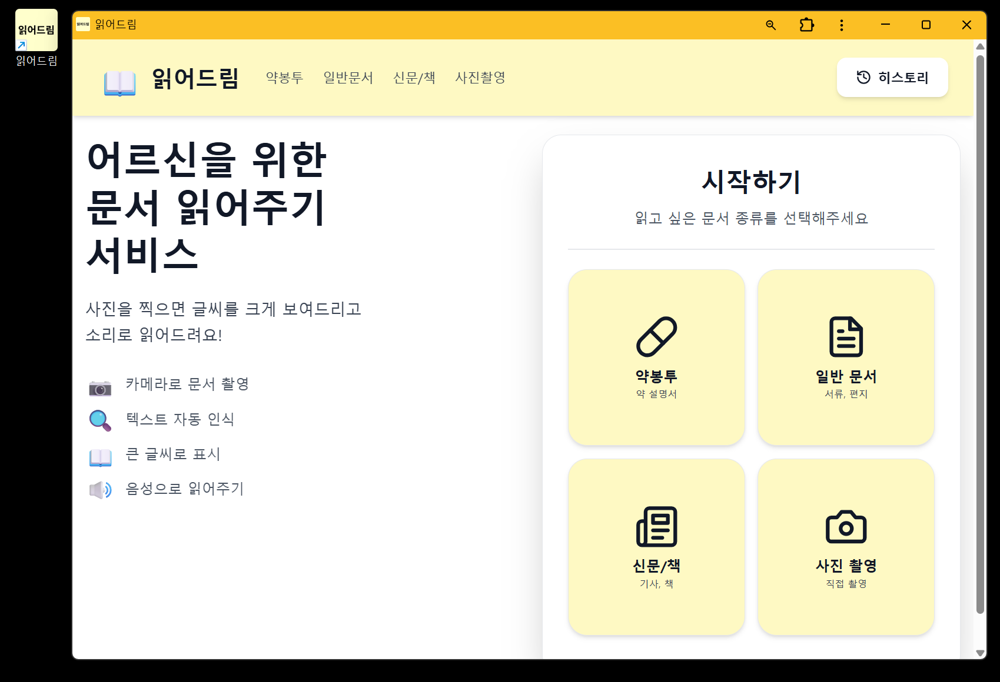
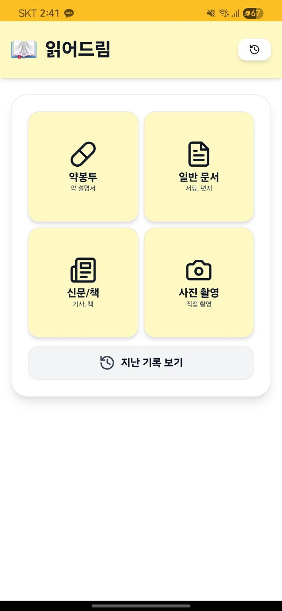

# 읽어드림 - 시니어 친화 OCR PWA

> 어르신들을 위한 문서 읽어주기 앱

**🌐 데모:** [https://goodboy.kakaolab.cloud](https://goodboy.kakaolab.cloud)

---

## Preview

### PC/모바일 웹 화면



### PWA 앱 설치 화면



> 📱 **PWA 앱 설치 완료!** 모바일 홈 화면에 추가하여 네이티브 앱처럼 사용 가능합니다.

## 프로젝트 소개

**타겟 사용자:** 시니어층 (60세 이상)

**주요 기능:**

- 📷 카메라로 문서 촬영 (HTTPS 환경에서 안전하게)
- 🔍 텍스트 자동 인식 (Tesseract OCR, 한글+영문)
- 📖 큰 글씨로 결과 표시 (시니어 친화 UI)
- 🔊 음성으로 읽어주기 (TTS, 속도 조절 가능)
- 💾 히스토리 저장 및 관리 (SQLite DB)
- 📱 PWA 지원 (홈 화면 추가 가능)

**사용 시나리오:**

- 💊 약 봉투 글씨 읽기
- 📄 공공기관 서류 확인
- 📰 신문 기사 크게 보기
- 📦 택배 송장 정보 확인

**접속 방법:**

- 웹: https://goodboy.kakaolab.cloud
- 모바일: 위 주소로 접속 후 "홈 화면에 추가"

---

## 기술 스택

| 구분              | 기술                                                                                                                                                                           |
| ----------------- | ------------------------------------------------------------------------------------------------------------------------------------------------------------------------------ |
| **Frontend**      | Next.js 14.1, React 18.2, TypeScript, Tailwind CSS, Axios                                                                                                                      |
| **Backend**       | FastAPI 0.109, Python 3.11, SQLAlchemy, SQLite (aiosqlite)                                                                                                                     |
| **OCR**           | Tesseract OCR, pytesseract, OpenCV, Pillow                                                                                                                                     |
| **TTS**           | Web Speech API                                                                                                                                                                 |
| **PWA**           | manifest.json, Service Worker 지원                                                                                                                                             |
| **배포**          | Docker, Docker Compose, Nginx, Docker Hub                                                                                                                                      |
| **도메인**        | goodboy.kakaolab.cloud (HTTPS)                                                                                                                                                 |
| **Docker 이미지** | [leelaeloo/senior-ocr-frontend](https://hub.docker.com/r/leelaeloo/senior-ocr-frontend), [leelaeloo/senior-ocr-backend](https://hub.docker.com/r/leelaeloo/senior-ocr-backend) |

**아키텍처 (프로덕션):**

```
브라우저 (goodboy.kakaolab.cloud)
    ↓ HTTPS (443)
Nginx (리버스 프록시)
    ├─→ / (Frontend 요청) → Next.js Container (:3000)
    └─→ /api/* (API 요청) → FastAPI Container (:8000)
                                    ↓
                            Tesseract OCR 처리
                                    ↓
                            SQLite DB 저장
```

**로컬 개발:**

```
브라우저 (localhost:3000)
    ↓
Frontend (:3000) → Backend (:8000) → Tesseract OCR → SQLite DB
```

---

## 프로젝트 구조

```
senior-ocr-pwa/
├── backend/
│   ├── main.py                   # FastAPI 서버
│   ├── database.py               # DB 연결 및 설정
│   ├── models.py                 # SQLAlchemy 모델
│   ├── requirements.txt          # Python 의존성
│   ├── Dockerfile                # 백엔드 이미지
│   └── ocr_history.db            # SQLite DB (런타임 생성)
├── frontend/
│   ├── app/
│   │   ├── page.tsx              # 메인 화면 (카메라/OCR)
│   │   ├── layout.tsx            # 레이아웃 및 메타데이터
│   │   ├── globals.css           # 전역 스타일
│   │   └── history/
│   │       └── page.tsx          # 히스토리 페이지
│   ├── public/
│   │   ├── manifest.json         # PWA 설정
│   │   ├── android-chrome-*.png
│   │   └── apple-touch-icon.png
│   ├── package.json              # Node 의존성
│   ├── Dockerfile                # 프론트엔드 이미지
│   └── tailwind.config.ts        # Tailwind 설정
├── nginx/
│   └── conf.d/
│       └── default.conf          # Nginx 리버스 프록시 설정
├── screenshots/                  # README용 스크린샷
│   ├── main-pc.png
│   └── main-app.png
├── docker-compose.yml            # Docker Compose 설정
└── README.md
```

---

## 빠른 시작

### 1. 프로덕션 배포 (현재 운영 중)

**이미 배포된 서비스:**

- 🌐 **URL**: [https://goodboy.kakaolab.cloud](https://goodboy.kakaolab.cloud)
- 🔒 **HTTPS**: Let's Encrypt SSL 인증서
- 🚀 **서버**: Nginx 리버스 프록시 + Docker Compose

**서버에서 실행 중인 구성:**

```bash
# 프로덕션 서버에서
docker compose up -d
```

**접속 방법:**

- Web: https://goodboy.kakaolab.cloud
- API: https://goodboy.kakaolab.cloud/api

---

### 2. 로컬에서 테스트 (도커허브 이미지 사용)

도커허브의 빌드된 이미지로 로컬에서 테스트할 수 있습니다.

```bash
# 이미지 다운로드
docker pull leelaeloo/senior-ocr-frontend:v1.1
docker pull leelaeloo/senior-ocr-backend:v1.1

# docker-compose.yml에서 image 사용하도록 수정 후 실행
docker compose up
```

**로컬 접속:** http://localhost:3000

**사용 가능한 이미지:**

- `leelaeloo/senior-ocr-frontend:v1.1` (756MB) - 프론트엔드
- `leelaeloo/senior-ocr-backend:v1.1` (539MB) - 백엔드
- `leelaeloo/senior-ocr-frontend:latest` - 최신 버전
- `leelaeloo/senior-ocr-backend:latest` - 최신 버전

---

### 3. Docker Compose 로컬 빌드

소스코드를 수정하고 로컬에서 빌드/테스트:

```bash
docker compose up --build
```

**로컬 접속:** http://localhost:3000

---

### 4. 로컬 개발 (Docker 없이)

> **참고**: 프로덕션 환경(https://goodboy.kakaolab.cloud)은 Docker Compose로 운영됩니다. 이 섹션은 Docker 없이 직접 개발할 때만 사용하세요.

**Backend (Python 3.11 필요):**

```bash
cd backend
pip install -r requirements.txt

# Tesseract 설치 필요:
# Ubuntu/Debian: sudo apt-get install tesseract-ocr tesseract-ocr-kor tesseract-ocr-eng
# macOS: brew install tesseract tesseract-lang

# 백엔드 서버 실행 (Docker 없이 로컬 개발할 때만)
uvicorn main:app --reload --host 0.0.0.0 --port 8000
```

접속: http://localhost:8000

**Frontend (Node.js 20 권장):**

```bash
cd frontend
npm install

# 프론트엔드 서버 실행 (Docker 없이 로컬 개발할 때만)
npm run dev
# 또는 네트워크에서 접속하려면:
# npm run dev:network
```

접속: http://localhost:3000

> **Docker Compose 사용 시**: 위 명령어들은 **불필요**합니다. `docker compose up`만으로 모든 서비스가 자동 실행됩니다.

### 5. 모바일/네트워크 테스트

**프로덕션 환경 (권장):**

- 모바일에서 https://goodboy.kakaolab.cloud 접속
- HTTPS이므로 카메라, PWA 등 모든 기능 사용 가능

---

## 주요 기능

### 1. 시니어 친화 UI

- **큰 버튼**: 최소 60px 높이, 넉넉한 터치 영역
- **큰 글씨**: 18-30px 크기, 진한 폰트
- **고대비 색상**: 노란색 배경 (yellow-50~300) + amber 텍스트
- **간단한 동선**: 메인 → 촬영 → 결과 (3단계)

### 2. OCR 처리 및 이미지 전처리

**이미지 전처리 파이프라인:**

```python
# 1. 그레이스케일 변환
# 2. 노이즈 제거 (fastNlMeansDenoising)
# 3. 적응형 이진화 (adaptiveThreshold)
# 4. Tesseract OCR (kor+eng, --oem 3 --psm 6)
```

**API 처리 흐름:**

```bash
POST /api/ocr
# 1. 이미지 업로드 (10MB 이하)
# 2. 이미지 전처리
# 3. Tesseract OCR 실행
# 4. 결과 DB 저장 (SQLite)
# 5. 결과 JSON 파일 저장 (백업)
# 응답: { task_id, text, confidence, word_count, words }
```

### 3. TTS (음성 읽기)

```typescript
const speak = (text: string) => {
  const utterance = new SpeechSynthesisUtterance(text);
  utterance.lang = "ko-KR";
  utterance.rate = 0.8; // 천천히
  speechSynthesis.speak(utterance);
};
```

### 4. 히스토리 관리

**비동기 데이터베이스 (SQLite + aiosqlite):**

```bash
GET /api/history?limit=50       # 목록 조회
GET /api/history/{id}            # 상세 조회
DELETE /api/history/{id}         # 삭제
```

**저장 데이터:**

- OCR 추출 텍스트
- 신뢰도 (confidence)
- 단어 수 (word_count)
- 생성 시각 (created_at)

---

## API 엔드포인트

**Base URL (프로덕션):** `https://goodboy.kakaolab.cloud`
**Base URL (로컬):** `http://localhost:8000`

| 메서드 | 경로                    | 설명                                |
| ------ | ----------------------- | ----------------------------------- |
| GET    | `/`                     | 헬스 체크                           |
| POST   | `/api/ocr`              | OCR 처리 (multipart/form-data)      |
| GET    | `/api/result/{task_id}` | OCR 결과 조회 (task_id로)           |
| GET    | `/api/history`          | 히스토리 목록 조회 (limit 파라미터) |
| GET    | `/api/history/{id}`     | 히스토리 상세 조회                  |
| DELETE | `/api/history/{id}`     | 히스토리 삭제                       |

**프로덕션 API 호출 예시:**

```bash
# OCR 처리
curl -X POST https://goodboy.kakaolab.cloud/api/ocr \
  -F "file=@image.jpg" \
  -F "language=kor+eng"

# 히스토리 조회
curl https://goodboy.kakaolab.cloud/api/history?limit=10
```

**로컬 API 호출 예시:**

```bash
# OCR 처리 (로컬)
curl -X POST http://localhost:8000/api/ocr \
  -F "file=@image.jpg" \
  -F "language=kor+eng"
```

**응답 예시:**

```json
{
  "success": true,
  "task_id": "uuid-string",
  "data": {
    "text": "추출된 텍스트",
    "confidence": 92.5,
    "word_count": 15,
    "words": [...]
  }
}
```

---

## 문제 해결

### Tesseract 설치

```bash
# Ubuntu/Debian
sudo apt-get install tesseract-ocr tesseract-ocr-kor

# macOS
brew install tesseract tesseract-lang
```

### 카메라 권한

**프로덕션 (https://goodboy.kakaolab.cloud):**

- ✅ HTTPS 지원으로 카메라 접근 가능
- 브라우저에서 카메라 권한 허용 필요

**로컬 개발 (http://localhost):**

- ⚠️ HTTP 환경에서는 카메라 접근 제한될 수 있음
- Chrome/Edge: localhost는 보안 예외로 허용됨
- 다른 네트워크 접속 시 HTTPS 필요

### Docker 빌드 실패

```bash
docker compose down
docker compose build --no-cache
docker compose up
```

---

## 배포

### 현재 프로덕션 환경

**배포 정보:**

- 🌐 **도메인**: https://goodboy.kakaolab.cloud
- 🖥️ **서버**: 카카오 클라우드
- 🔒 **SSL**: Let's Encrypt (자동 갱신)
- 🐳 **컨테이너**: Docker Compose로 관리
  - Frontend (Next.js): 포트 3000
  - Backend (FastAPI): 포트 8000
  - Nginx: 포트 80, 443

**서버에서 관리:**

```bash
# 서비스 시작
docker compose up -d

# 서비스 중단
docker compose down

# 로그 확인
docker compose logs -f

# 컨테이너 상태 확인
docker compose ps

# 이미지 업데이트 및 재시작
docker compose pull
docker compose up -d --force-recreate
```

---

### Docker 이미지 빌드 및 푸시

**프론트엔드 이미지:**

```bash
# 프로젝트 루트에서
docker build -t <username>/senior-ocr-frontend:v1.1 ./frontend
docker push <username>/senior-ocr-frontend:v1.1
```

**백엔드 이미지:**

```bash
# 프로젝트 루트에서
docker build -t <username>/senior-ocr-backend:v1.1 ./backend
docker push <username>/senior-ocr-backend:v1.1
```

> **참고**: `<username>`을 본인의 Docker Hub 사용자명으로 변경하세요.

**latest 태그 추가:**

```bash
docker tag <username>/senior-ocr-frontend:v1.1 <username>/senior-ocr-frontend:latest
docker tag <username>/senior-ocr-backend:v1.1 <username>/senior-ocr-backend:latest
docker push <username>/senior-ocr-frontend:latest
docker push <username>/senior-ocr-backend:latest
```

### 프로덕션 배포 권장사항

1. **버전 태그 사용**: `latest` 대신 `v1.1` 같은 버전 태그 사용
2. **환경변수 설정**:
   - `NEXT_PUBLIC_API_URL=https://your-domain.com/api`
   - `DEBUG=false` (프로덕션)
3. **볼륨 마운트**: 데이터 영속성을 위해 DB 및 업로드 파일 볼륨 설정
   ```yaml
   volumes:
     - ./backend/uploads:/app/uploads
     - ./backend/results:/app/results
     - ./backend/ocr_history.db:/app/ocr_history.db
   ```
4. **리버스 프록시**: Nginx 설정
   - HTTP → HTTPS 리다이렉션
   - SSL 인증서 (Let's Encrypt)
   - 보안 헤더 추가
5. **도메인 및 DNS**: A 레코드 설정
6. **방화벽**: 80, 443 포트 오픈
7. **모니터링**: 로그 수집 및 헬스 체크 설정

**Nginx 설정 예시:**

nginx/conf.d/default.conf 참조 - 현재 프로덕션에서 사용 중

---

## 구현 상태

### ✅ 완료

**기본 기능:**

- [x] 카메라 촬영 + 갤러리 선택
- [x] Tesseract OCR 처리 (한글+영문)
- [x] 이미지 전처리 (그레이스케일, 노이즈 제거, 이진화)
- [x] 큰 글씨 결과 표시
- [x] TTS 음성 읽기 기능
- [x] 히스토리 저장/조회/상세/삭제

**UI/UX:**

- [x] 시니어 친화 UI (노란색 테마, 큰 버튼)
- [x] 반응형 디자인 (모바일/태블릿/PC)
- [x] 고대비 색상 설계

**데이터 관리:**

- [x] 비동기 SQLite DB (aiosqlite)
- [x] JSON 백업 파일 저장
- [x] OCR 결과 메타데이터 (신뢰도, 단어 수)

**배포 및 인프라:**

- [x] Docker 컨테이너화
- [x] Docker Compose 오케스트레이션
- [x] Docker Hub 이미지 배포 (v1.1)
- [x] Nginx 리버스 프록시
- [x] HTTPS/SSL 인증서 (Let's Encrypt)
- [x] 도메인 연결 (goodboy.kakaolab.cloud)

**PWA:**

- [x] manifest.json 설정
- [x] PWA 아이콘 (Android, iOS)
- [x] 메타데이터 설정
- [x] 홈 화면 추가 지원 (Add to Home Screen)
- [x] 모바일 앱 설치 완료

### 🔄 향후 개선

- [ ] Service Worker 구현 (완전한 오프라인 지원)
- [ ] 앱 설치 프롬프트 자동화 (BeforeInstallPrompt)
- [ ] 글자 크기 동적 조절
- [ ] 다국어 지원 (영어, 일본어 등)
- [ ] OCR 결과 편집 기능
- [ ] 이미지 미리보기 및 편집
- [ ] 히스토리 검색 기능
- [ ] PDF 내보내기

---
